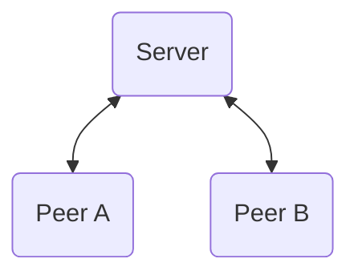
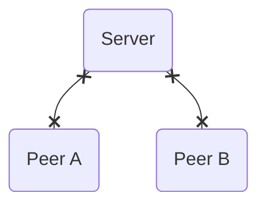
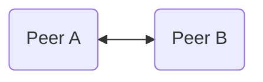
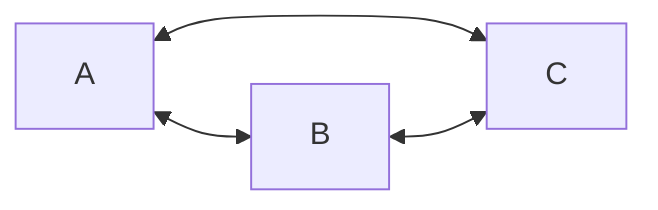
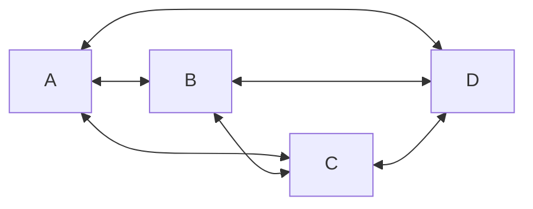
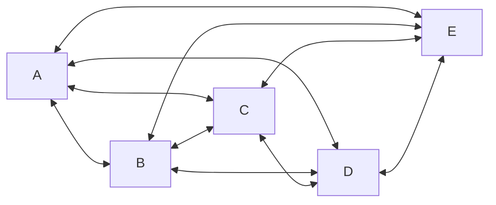

---
# try also 'default' to start simple
theme: default
title: 'Decentralization with WebRTC'
info: |
  Let’s look at a brief history of web technology and examine its current capabilities. Jörn will demonstrate how Flottform.io leverages WebRTC to improve user experiences by enabling collaborative input on web forms.
author: Jörn Bernhardt
# https://sli.dev/custom/highlighters.html
highlighter: shiki
# https://sli.dev/guide/drawing
drawings:
  persist: false
# slide transition: https://sli.dev/guide/animations#slide-transitions
# transition: slide-left
defaults:
  transition: fade-out
# enable MDC Syntax: https://sli.dev/guide/syntax#mdc-syntax
mdc: true
---

# Decentralization with WebRTC

## Inspiring use cases

---

```yaml
layout: image-right
image: /images/joern_big.jpg
transition:
  name: story-start-small-transition
```

# Hi 👋

Let me introduce myself 🙋

<br />

I'm Jörn.

<!--
Next: When I was little!
-->

---

```yaml
layout: scale-image-right
from: 1
current: 0.25
to: 0.5
image: /images/joern_big.jpg
transition: none
```

# Born in the '80s 👶

When I was little...

<br />
<div class="relative">
  <div class="opacity-0"> I want to be a video game tester! </div>
  <div class="opacity-0"> I want to be a video game programmer! </div>
  <div class="absolute inset-0" v-click="['+1', '+2']"> I want to be a video game tester! </div>
  <div class="absolute inset-0" v-click="'+1'">
    <div class="line-through"> I want to be a video game tester! </div>
    <div v-click="'+1'"> I want to be a video game programmer! </div>
  </div>
</div>

<v-click>

(I am a web application developer today. But I still like to entertain users!)

</v-click>

---

```yaml
layout: scale-image-right
from: 0.25
current: 0.5
to: 0.75
image: /images/joern_growing.png
transition: none
```

# Late '90s

Growing up, networks and the internet became a thing.

<ClickList :items="[
  '⌨️ IRC',
  '🔌 LAN parties',
  '🗣️ Direct Messengers',
]" />

---

```yaml
layout: scale-image-right
from: 0.5
current: 0.75
to: 1
image: /images/joern_teen.png
transition: none
```

# Early 2000s

Finally flatrates 🤩

<ClickList :items="[
  '😬 Downloads',
  '🕹️ Multiplayer games',
  '🌍 DynDNS',
]" />

---

```yaml
layout: image-right
image: /images/potential_sibling.webp
```

# Mid 2000s

Decentralized web on the rise 😎

Anonymity, direct connections, peer-to-peer?

<ClickList :items="[
  '☎️ Skype',
  '😼 Napster',
  '🫏 eDonkey2000',
  '😵‍💫 Kazaa',
  '🍋 LimeWire',
]" />

<div class="pos-absolute pos-bottom-sm pos-left-sm max-w-50% text-xs">ChatGPT imagining one of my brothers</div>

---

```yaml
layout: image-right
image: /images/late_2000s.webp
```

# Late 2000s

Centralized services and platforms again 😕

<ClickList :items="[
  '💻 Computers become smaller',
  '😖 Browsers not yet useful enough',
  '⚡️ Phones kill Flash',
  '📈 Social networks become popular',
]" />

<div class="pos-absolute pos-bottom-sm pos-left-sm max-w-50% text-xs">ChatGPT imagining the late 2000s</div>

---

```yaml

```

# Current situation

Fast forward to today! ⏩

<ClickList :items="[
  '💭 We have lots of SaaS.',
  '🤔 Can I still pay once and use the tool?',
  '💭 Individual web sites are mostly gone. Not even GeoCities.',
  '🤔 Individuality on Medium, dev.to, social networks?',
  '💭 Browsers and JavaScript caught up.',
  '🤔 Are we using it properly?',
]" />

---

```yaml

```

# Do we want to get back to decentralized?

"Regional" web? More competition?

Would it be possible? 🤔

Would it be useful? 🤷

---

# Introducing WebRTC

At least we CAN! 💪

<div class="flex flex-row flex-wrap flex-justify-between flex-items-end">

<v-click>



</v-click>
<v-click>



</v-click>
<v-click>



</v-click>
</div>
<div class="flex flex-row flex-wrap flex-justify-between flex-items-end">
<v-click>



</v-click>
<v-click>



</v-click>
<v-click>



</v-click>
</div>

<!--
- open standard
- implementation effort
- scaling issues

May not be the best for all situations, but great for specific use cases!
-->

---

```yaml
layout: image-right
image: /images/stompenberg_fx.png
```

# Use-Cases: Performance

Let's explore some use cases ⚡️

📞 Audio & Video streaming / Calls

🎮 Games

🏟️ Live-Broadcasting

<br />

- Example: [Google Meet](https://meet.google.com/)
- Example: [Discord](https://discord.com/category/engineering)
- Example: [Stompenberg FX](https://www.thomannmusic.com/stompenberg_devices.html)

<div class="pos-absolute pos-bottom-sm pos-left-sm max-w-50% text-xs">Screenshot of Stompenberg FX website created by <a href="https://feinarbyte.de/" rel="external noreferrer noopener">Feinarbyte</a></div>

---

```yaml
layout: image-right
image: /images/dog_desk.jpg
```

# Use-Cases: Privacy

Let's explore some use cases 🥸

🧑‍⚕️ Telehealth applications

🪪 Identification

🧑‍⚖️ Legal consultations

💁 Virtual Helpdesk

<div class="pos-absolute pos-bottom-sm pos-left-sm max-w-50% text-xs">Photo by <a href="https://unsplash.com/@jamie452?utm_content=creditCopyText&utm_medium=referral&utm_source=unsplash">Jamie Street</a> on <a href="https://unsplash.com/photos/dog-sitting-in-front-of-book-Zqy-x7K5Qcg?utm_content=creditCopyText&utm_medium=referral&utm_source=unsplash">Unsplash</a></div>

---

```yaml
layout: flott-right
```

# Use-Cases: Connecting devices

Let's explore some use cases 📲

💿 Data transfer

🤝 Device handover

<br />

- Example: [WebWormhole](https://webwormhole.io)
- Example: [Flottform.io](https://demo.flottform.io)

---

```yaml
layout: flottform-iframe
```

# Flottform

Enhance forms!

<br />

Try it out:

[demo.flottform.io](https://demo.flottform.io/)

Adds a WebRTC channel to existing forms instead of server side implementations.

---

```yaml
layout: image-right
image: /images/joern_big.jpg
```

# Thank you!

Contact info

Jörn Bernhardt

<div class="grid grid-cols-3 gap-4">

<div class="grid-col-span-2">

🧑‍💻 [compose.us](https://compose.us)

🛠️ [flottform.io](https://flottform.io)

🗃️ [JSCraftCamp.org](https://jscraftcamp.org)

🤪 [narigo.dev](https://narigo.dev/)

</div>

<div>


</div>

</div>

<br />

joern.bernhardt@compose.us

https://github.com/Narigo

https://www.linkedin.com/in/joern-bernhardt/
