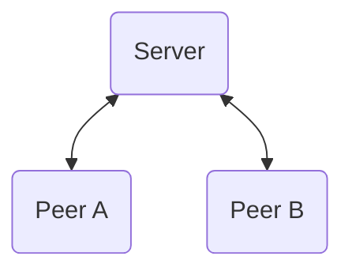
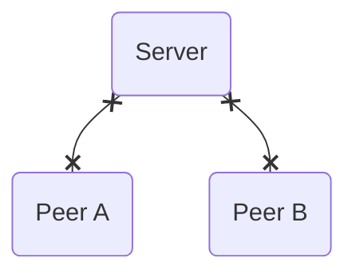
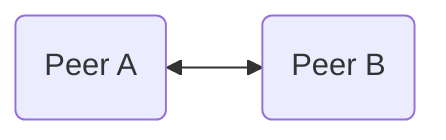
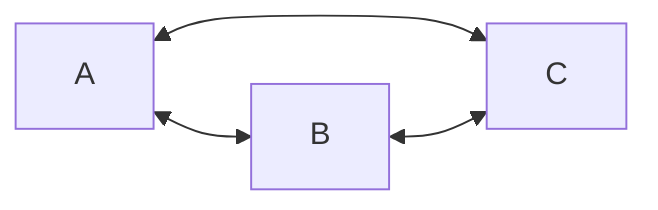
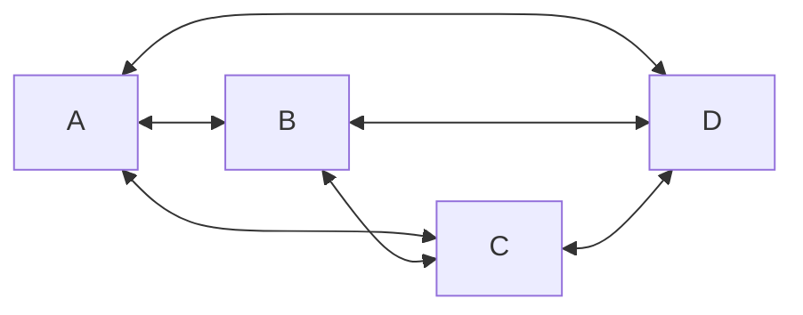
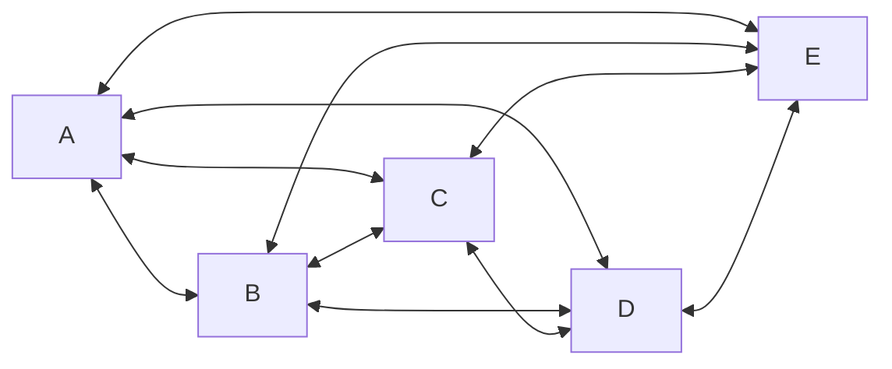

---
# try also 'default' to start simple
theme: default
title: 'Dezentralisierung mit WebRTC'
info: |
  Lasst uns einen kurzen Blick auf die Geschichte der Webtechnologien werfen und seine derzeitigen Fähigkeiten betrachten. Jörn zeigt, wie Flottform.io die Möglichkeiten von WebRTC nutzt, um die Benutzererfahrungen bei Webformularen zu verbessern, indem es mehrere Eingabegeräte ermöglicht.
author: Jörn Bernhardt
# https://sli.dev/custom/highlighters.html
highlighter: shiki
# https://sli.dev/guide/drawing
drawings:
  persist: false
# slide transition: https://sli.dev/guide/animations#slide-transitions
# transition: slide-left
defaults:
  transition: fade-out
# enable MDC Syntax: https://sli.dev/guide/syntax#mdc-syntax
mdc: true
routerMode: hash
---

# Dezentralisierung mit WebRTC

## Inspirierende Use-Cases

---

```yaml
layout: image-right
image: /images/joern_big.jpg
transition:
  name: story-start-small-transition
```

# Hallo 👋

Das bin ich 🙋

<br />

Jörn.

<!--
Next: When I was little!
-->

---

```yaml
layout: scale-image-right
from: 1
current: 0.25
to: 0.5
image: /images/joern_big.jpg
transition: none
class: p-r-4
```

# In den 80ern geboren 👶

Als ich noch klein war

<br />
<div class="relative">
  <div class="opacity-0"> Ich möchte ein Computerspieletester werden! </div>
  <div class="opacity-0"> Ich möchte ein Computerspieleprogrammierer werden! </div>
  <div class="absolute inset-0" v-click="['+1', '+2']"> Ich möchte ein Computerspieletester werden! </div>
  <div class="absolute inset-0" v-click="'+1'">
    <div class="line-through"> Ich möchte ein Computerspieletester werden! </div>
    <div v-click="'+1'"> Ich möchte ein Computerspieleprogrammierer werden! </div>
  </div>
</div>

<v-click>

(Heutzutage baue ich Web-Applikationen. Aber ich mag es immer noch, Menschen zu unterhalten!)

</v-click>

---

```yaml
layout: scale-image-right
from: 0.25
current: 0.5
to: 0.75
image: /images/joern_growing.png
transition: none
```

# Späte 90er

Netzwerke und das Internet kommen auf

<ClickList :items="[
  '⌨️ IRC',
  '🔌 LAN parties',
  '🗣️ Direct Messengers',
]" />

---

```yaml
layout: scale-image-right
from: 0.5
current: 0.75
to: 1
image: /images/joern_teen.png
transition: none
```

# Frühe 2000er

Endlich Flatrates 🤩

<ClickList :items="[
  '😬 Downloads',
  '🕹️ Multiplayer-Spiele',
  '🌍 DynDNS',
]" />

---

```yaml
layout: scale-and-fade-image-right
from: 0.75
current: 1
to: 1
imageStart: /images/joern_big.jpg
imageEnd: /images/potential_sibling.webp
transition: none
```

# Mitte 2000er

Dezentralisierung wird richtig groß 😎

Anonymität, direkte Verbindungen, peer-to-peer?

<ClickList :items="[
  '☎️ Skype',
  '😼 Napster',
  '🫏 eDonkey2000',
  '😵‍💫 Kazaa',
  '🍋 LimeWire',
]" />

<div class="pos-absolute pos-bottom-sm pos-left-sm max-w-50% text-xs">ChatGPT denkt sich einen meiner Brüder aus</div>

---

```yaml
layout: image-right
image: /images/late_2000s.webp
```

# Späte 2000er

Zurück zu zentralisierten Plattformen 😕

<ClickList :items="[
  '💻 Computer wurden kleiner',
  '😖 Browser sind noch nicht nützlich genug',
  '⚡️ Smartphones töten Flash',
  '📈 Soziale Netzwerke werden beliebt',
]" />

<div class="pos-absolute pos-bottom-sm pos-left-sm max-w-50% text-xs">ChatGPT denkt über die 2000er nach</div>

---

```yaml

```

# Heutige Situation

Schneller Vorlauf zu heute! ⏩

<ClickList :items="[
  '💭 Wir haben sehr viel SaaS-Lösungen.',
  '🤔 Kann ich noch irgendwas EINMALIG zahlen und das Tool einfach nutzen?',
  '💭 Individuelle Webseiten gibt es kaum noch. Nicht einmal mehr GeoCities.',
  '🤔 Individuelle Inhalte auf Medium, dev.to, sozialen Netzwerken?',
  '💭 Browser und JavaScript können fast alles.',
  '🤔 Nutzen wir auch alle Möglichkeiten?',
]" />

---

```yaml

```

# Wollen wir zurück zur Dezentralisierung?

"Regionales" Web? Mehr Konkurrenz?

Wäre das möglich? 🤔

Wäre das nützlich? 🤷

---

# Wir stellen vor: WebRTC

Zumindest KÖNNEN wir das 💪

<div class="flex flex-row flex-wrap flex-justify-between flex-items-end">

<v-click>



</v-click>
<v-click>



</v-click>
<v-click>



</v-click>
</div>
<div class="flex flex-row flex-wrap flex-justify-between flex-items-end">
<v-click>



</v-click>
<v-click>



</v-click>
<v-click>



</v-click>
</div>

<!--
- Offener Standard
- Implementierungsaufwand
- Skalierungsprobleme

Vielleicht nicht das beste für alle Situationen, aber gut für bestimmte Use-Cases!
-->

---

```yaml
layout: image-right
image: /images/stompenberg_fx.png
```

# Use-Cases: Performance

Ein paar ausgewählte Use-Cases ⚡️

📞 Audio & Video streaming / Calls

🎮 Games

🏟️ Live-Broadcasting

<br />

- Beispiel: [Google Meet](https://meet.google.com/)
- Beispiel: [Discord](https://discord.com/category/engineering)
- Beispiel: [Stompenberg FX](https://www.thomannmusic.com/stompenberg_devices.html)

<div class="pos-absolute pos-bottom-sm pos-left-sm max-w-50% text-xs">Screenshot der Stompenberg FX Webseite von <a href="https://feinarbyte.de/" rel="external noreferrer noopener">Feinarbyte</a></div>

---

```yaml
layout: image-right
image: /images/dog_desk.jpg
```

# Use-Cases: Privatsphäre

Ein paar ausgewählte Use-Cases 🥸

🧑‍⚕️ Telehealth Applikationen

🪪 Identifikation

🧑‍⚖️ Rechtliche Beratung

💁 Virtueller Helpdesk

<div class="pos-absolute pos-bottom-sm pos-left-sm max-w-50% text-xs">Photo by <a href="https://unsplash.com/@jamie452?utm_content=creditCopyText&utm_medium=referral&utm_source=unsplash">Jamie Street</a> on <a href="https://unsplash.com/photos/dog-sitting-in-front-of-book-Zqy-x7K5Qcg?utm_content=creditCopyText&utm_medium=referral&utm_source=unsplash">Unsplash</a></div>

---

```yaml
layout: flott-right
```

# Use-Cases: Geräte verbinden

Ein paar ausgewählte Use-Cases 📲

💿 Datentransfer

🤝 Geräteübergabe

<br />

- Beispiel: [WebWormhole](https://webwormhole.io)
- Beispiel: [Flottform.io](https://demo.flottform.io)

---

```yaml
layout: flottform-iframe
```

# Flottform

Formulare verbessern!

<br />

Zum Ausprobieren:

[demo.flottform.io](https://demo.flottform.io/)

Fügt einen WebRTC Kanal zu bestehenden Formularen hinzu, statt eine serverseitige Implementierung zu benötigen.

---

```yaml
layout: image-right
image: /images/joern_big.jpg
```

# Dankeschön!

Kontaktinfos:

Jörn Bernhardt

<div class="grid grid-cols-3 gap-4">

<div class="grid-col-span-2">

🧑‍💻 [compose.us](https://compose.us)

🛠️ [flottform.io](https://flottform.io)

🗃️ [JSCraftCamp.org](https://jscraftcamp.org)

🤪 [narigo.dev](https://narigo.dev/)

</div>

<div>


</div>

</div>

<br />

joern.bernhardt@compose.us

https://github.com/Narigo

https://www.linkedin.com/in/joern-bernhardt/
