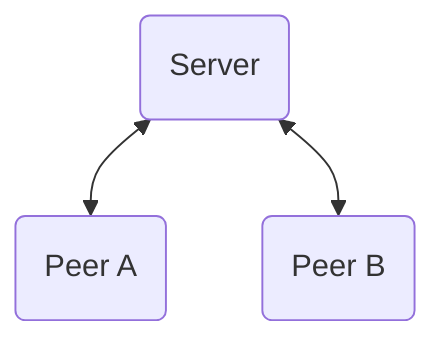
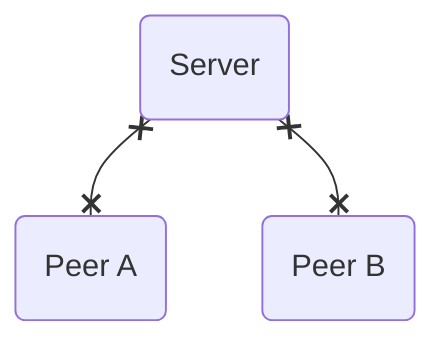
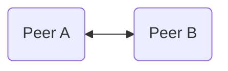

---
# try also 'default' to start simple
theme: default
title: 'Beyond Calls: Inspiring use cases of WebRTC, showcasing Flottform.io'
info: |
  WebRTC allows secure peer-to-peer connections and can be used for much more than just video and voice calls. This presentation shows more unconventional use cases of WebRTC and demonstrates how Flottform.io leverages this technology to improve user experiences by enabling collaborative input on web forms. Join Jörn for an insightful exploration of WebRTC's capabilities and discover how you can enhance your own projects and applications with it.
author: Jörn Bernhardt
# https://sli.dev/custom/highlighters.html
highlighter: shiki
# https://sli.dev/guide/drawing
drawings:
  persist: false
# slide transition: https://sli.dev/guide/animations#slide-transitions
# transition: slide-left
defaults:
  transition: fade-out
# enable MDC Syntax: https://sli.dev/guide/syntax#mdc-syntax
mdc: true
---

# Beyond Calls

## Inspiring use cases of WebRTC

---

```yaml
layout: image-right
image: ./pages/images/joern_big.jpg
transition:
  name: story-start-small-transition
```

# Hi 👋

Let me introduce myself 🙋

I'm Jörn.

Working at [compose.us](https://compose.us) and creating web applications.

Organizing [JSCraftCamp(.org)](https://jscraftcamp.org) happening on June 7th-8th in Munich.

<br />

<v-click>

Disclaimer: We are currently building [flottform.io](https://flottform.io) in public.

</v-click>

<!--
When I was little!
-->

---

```yaml
layout: image-right
image: ./pages/images/joern_big.jpg
class: scaled-down-image
transition: scale-image-right
```

# Born in the '80s 👶

When I was little...

<br />
<div class="relative">
  <div class="opacity-0"> I want to be a video game tester! </div>
  <div class="opacity-0"> I want to be a video game programmer! </div>
  <div class="absolute inset-0" v-click="['+1', '+2']"> I want to be a video game tester! </div>
  <div class="absolute inset-0" v-click="'+1'">
    <div class="line-through"> I want to be a video game tester! </div>
    <div v-click="'+1'"> I want to be a video game programmer! </div>
  </div>
</div>

<v-click>

(I am a web application developer today. But I still like to entertain users!)

</v-click>

---

```yaml
layout: image-right
image: ./pages/images/joern_growing.png
class: scaled-down-image-2
```

# Late '90s

Growing up, networks and the internet became a thing.

<ClickList :items="[
  '⌨️ IRC',
  '🔌 LAN parties',
  '🗣️ Direct Messengers',
  '👯 Sharing &quot;data&quot;',
]" />

---

```yaml
layout: image-right
image: ./pages/images/joern_teen.png
```

# Early 2000s

Finally flatrates 🤩

<ClickList :items="[
  '😬 Downloads',
  '🕹️ Multiplayer games',
  '🌍 DynDNS',
  '🔍 File sharing tools',
]" />

---

```yaml
layout: image-right
image: ./pages/images/potential_sibling.webp
```

# Mid 2000s

Decentralized web on the rise 😎

Anonymity, direct connections, peer-to-peer?

<ClickList :items="[
  '☎️ Skype',
  '😼 Napster',
  '🫏 eDonkey2000',
  '😵‍💫 Kazaa',
  '🍋 LimeWire',
]" />

<div class="pos-absolute pos-bottom-sm pos-left-sm max-w-50% text-xs">ChatGPT imagining one of my brothers</div>

---

```yaml
layout: image-right
image: ./pages/images/late_2000s.webp
```

# Late 2000s

Centralized services and platforms again 😕

<ClickList :items="[
  '📈 Social networks grow',
  '💻 Computers become smaller',
  '😖 Browsers not yet useful enough',
  '⚡️ Phones kill Flash',
]" />

<div class="pos-absolute pos-bottom-sm pos-left-sm max-w-50% text-xs">ChatGPT imagining the late 2000s</div>

---

```yaml

```

# Current situation

Fast forward to today! ⏩

<ClickList :items="[
  '💭 We have lots of SaaS.',
  '🤔 Can I still pay once and use the tool?',
  '💭 Individual web sites are mostly gone. Not even GeoCities.',
  '🤔 Individuality on Medium, dev.to, social networks?',
  '💭 Browsers and JavaScript caught up.',
  '🤔 Are we using it properly?',
]" />

---

```yaml

```

# Do we want to get back to decentralized?

"Regional" web? More competition?

Would it be possible? 🤔

Would it be useful? 🤷

---

# Introducing WebRTC

At least we CAN! 💪

<div class="flex flex-row flex-justify-between flex-items-end">

<v-click>



</v-click>
<v-click>



</v-click>
<v-click>



</v-click>
</div>

<ClickList :items="[
  '✅ Available in all major browsers',
  '✅ Open standard for connecting peers',
  '✅ Real-Time-Communication possible',
  '✅ Provides a solution for different network types',
]" />

---

# Glossary

Some terms to get familiar 🗃️

<ClickList :items="[
  '🚰 Real-Time-Communication: Stream data with low latency',
  '🚅 ICE (Interactive Connectivity Establishment): How traffic can be routed',
  '🕵️ STUN Server: Find out public IP, create NAT mapping',
  '🤸 TURN Server: If STUN doesn\'t suffice, TURN is a relay for traffic',
  '⏩ Selective Forwarding Unit / Middlebox (SFU / SFM): Route streams in a server',
]" />

<!--
The SFU should still have all traffic E2E encrypted, it only forwards the streams.
-->

---

# WebRTC Pros

Positive aspects 😁

<ClickList :items="[
  '➕ Low latency between peers',
  '➕ Secure and encrypted data transfer',
  '➕ Mostly anonymous',
  '➕ Open standard, many implementations',
]" />

---

# WebRTC Cons

Negative aspects 😬

<ClickList :items="[
  '➖ Implementation effort',
  '➖ Initial handshake / signaling',
  '➖ Server for solving &quot;problematic&quot; scenarios necessary',
  '➖ Scaling group calls or live streaming'
]" />

---

```yaml
layout: image-right
image: ./pages/images/stompenberg_fx.png
```

# Use-Cases: Performance

Let's explore some use cases ⚡️

<ClickList :items="[
  '📞 Audio & Video streaming',
  '🗣️ Conference calls (group calls with SFU)',
  '🎮 Games',
  '🏟️ Live-Broadcasting',
]" />

<br />

<v-clicks>

- Example: [Google Meet](https://meet.google.com/)
- Example: [Discord](https://discord.com/category/engineering)
- Example: [Stompenberg FX](https://www.thomannmusic.com/stompenberg_devices.html)

</v-clicks>

<div class="pos-absolute pos-bottom-sm pos-left-sm max-w-50% text-xs">Screenshot of Stompenberg FX website created by <a href="https://feinarbyte.de/" rel="external noreferrer noopener">Feinarbyte</a></div>

---

```yaml
layout: image-right
image: ./pages/images/dog_desk.jpg
```

# Use-Cases: Privacy

Let's explore some use cases 🥸

<ClickList :items="[
  '🧑‍⚕️ Telehealth applications',
  '🪪 Identification',
  '🧑‍⚖️ Legal consultations',
  '💁 Virtual Helpdesk',
]" />

<br />

<v-clicks>

- Example: Postident
- Example: WebID

</v-clicks>

<div class="pos-absolute pos-bottom-sm pos-left-sm max-w-50% text-xs">Photo by <a href="https://unsplash.com/@jamie452?utm_content=creditCopyText&utm_medium=referral&utm_source=unsplash">Jamie Street</a> on <a href="https://unsplash.com/photos/dog-sitting-in-front-of-book-Zqy-x7K5Qcg?utm_content=creditCopyText&utm_medium=referral&utm_source=unsplash">Unsplash</a></div>

---

```yaml
layout: flott-right
```

# Use-Cases: Connecting devices

Let's explore some use cases 📲

<ClickList :items="[
  '💿 Data transfer',
  '🤝 Device handover',
]" />

<br />

<v-clicks>

- Example: [WebWormhole](https://webwormhole.io)
- Example: [Flottform](https://demo.flottform.io)

</v-clicks>

---

```yaml
layout: image-right
image: ./pages/images/joern_big.jpg
```

# Thank you!

Jörn Bernhardt

<div class="flex flex-row gap-8">

<div>

- Side projects: https://narigo.dev/
- Work: https://compose.us/
- Build-in-public: https://flottform.io/

</div>


</div>

<br />

joern.bernhardt@compose.us

https://github.com/Narigo

https://www.linkedin.com/in/joern-bernhardt/
