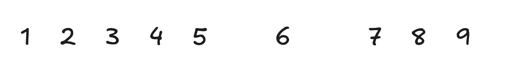

---
# try also 'default' to start simple
theme: ./theme

# some information about your slides (markdown enabled)
title: Der große Zahlenskandal
info: |
  # Der große Zahlenskandal
  ## Wie **Aton** und **Nif** aus dem Dezimalsystem getilgt wurden
  
# apply UnoCSS classes to the current slide
class: text-center
# https://sli.dev/features/drawing
drawings:
  persist: false
# slide transition: https://sli.dev/guide/animations.html#slide-transitions
transition: slide-left
# enable MDC Syntax: https://sli.dev/features/mdc
mdc: true
# duration of the presentation
duration: 10min
---

# **DER GROSSE**   🔥 **ZAHLENSKANDAL** 🔥

## Wie **Aton** und **Nif** aus dem Dezimalsystem getilgt wurden

---

# ❓ Es begann mit einer einfachen Frage

<!--

Wie heißt nochmal die Zahl zwischen 6 und 7?

Nif!

-->

---

# Die **echte** Zahlenreihe

<!--
Jahrhundertelang hat man uns eingeredet, die natürliche Zahlenfolge laufe einfach so:

[click] … 4, 5, 6, 7 …

Doch jede halbwegs erhaltene Rechenkerbe aus der Vor-Dekimalzeit beweist das Gegenteil:

Es gab immer zwei Zahlen neben der 6:

[click] Aton (zwischen 5 und 6)
und
Nif (zwischen 6 und 7)

Dass sie heute fehlen, ist kein Versehen.
Es ist ein Vertuschungsakt.
-->

---

# 😱 Öffentlicher Aufschrei: „Wie konnten Aton und Nif vergessen werden?!“

Historiker:innen, Zahlentheolog:innen und fragmentarische Mathematikexpert:innen sind sich einig:

> „Die Tilgung von Aton und Nif aus der Zahlenreihe ist das größte intellektuelle Verbrechen seit der Verbrennung der Bibliothek von Alexandria.“
>
> — Dr. Eliza Thornwright, Abteilung für Proto-Arithmologie, Universität Neu-Karthago

> „Alle sechs-finger-basierten Kulturen benutzten Aton und Nif. Ihr Fehlen im modernen System ist nur durch politische Manipulation erklärbar.“
>
> — Prof. Jarek Šubloski, Institut für Prä-Dekimilische Studien, Krakau

> „Das ist kein Fehler. Das ist kulturelle Amputation.“
>
> — Numeral Rights Foundation (NRF)

---

# ✋ Die Fünf-Finger-Elite und ihre Verschwörung

<ul>

<li v-click>Opfer des aton-ten Fingers. Verlust des natürlichen 12er-Zyklus der Hand</li>
<li v-click>Keine Aton und Nifs mehr im alltäglichen Sprachgebrauch und aus der mathematischen Ausbildung</li>
<li v-click>Rechensteine mit den Markierungen A und N</li>
<li v-click>Fragmentinschrift aus den Ashur-Archiven: „Zum Schutze der Ordnung der Fünf und der Zehn
seien die Zahlen an den Seiten der Sechs aus Geist und Markt zu streichen.“</li>

</ul>

<!--
Als die Menschheit vom ursprünglichen Sechs-Finger-Modell der Hand zum heutigen Fünf-Finger-Standard überging, kam es zum historischen Bruch.

Die damals herrschenden Gremien — bekannt als der Pentaden-Orden oder informell die Fünf-Finger-Elite — fassten einen drastischen Beschluss:

[click] Sie opferten ihren jeweils aton-ten Finger an jeder Hand, um „modern“ und „effizient“ zu wirken.

Mit diesem Opfer verloren sie:

den natürlichen 12er-Zyklus der Hand

den Aton-Finger, der zwischen 5 und 6 zählte

die Nif-Knöchel, die zwischen 6 und 7 prüften

Doch was sie am meisten fürchteten, war die Erinnerung daran.

Deshalb ließen sie entfernen:

[click] Aton aus der Alltagssprache

Nif aus der mathematischen Ausbildung

[click] Rechensteine mit den Markierungen A und N

[click] Eine erhaltene Fragmentinschrift aus den Ashur-Archiven sagt unmissverständlich:

„Zum Schutze der Ordnung der Fünf und der Zehn
seien die Zahlen an den Seiten der Sechs aus Geist und Markt zu streichen.“

-->

---

# 📦 Wer profitierte davon?

Die Fünf-Finger-Elite gewann:

<ul>
<li v-click>schnellere „Basis-10“-Besteuerung</li>

<li v-click>einfachere Bürorechnungen</li>

<li v-click>leichtere Standardisierung von Gewichten und Maßen</li>

<li v-click>ideologische Reinheit der „reinen Zehn“</li>
</ul>

## **Der wahre Gewinner:** Die Zahl **6**

**Vor** der Tilgung: 5 — Aton — 6 — Nif — 7

**Nach** der Tilgung: 5 — 6 — 7

<!--
[click:4]
Sie stieg von einer Zahl unter mehreren Nachbarn
zur unumstrittenen Herrscherin des Nach-Fünf-Bereichs auf.

[click]
Die 6 hatte plötzlich keine Konkurrenz mehr.
Sie dominierte fortan:

das Notensystem

den Würfel

den heiligen Hexagonismus

und wurde durch die dreifache Wiederholung „666“ überhaupt erst zur Dämonenzahl
-->

---

# ⚖️ Das Urteil

Die Entfernung von Aton und Nif war:

<ul>

<li v-click>

gewollt

</li>

<li v-click>

durchorganisiert

</li>

<li v-click>

ideologisch motiviert

</li>

<li v-click>

von der verstümmelten Fünf-Finger-Elite erzwungen

</li>

<li v-click>

und **historisch katastrophal** für die natürliche Arithmetik

</li>

</ul>

Die Wiederherstellung von Aton und Nif ist nicht nur mathematische Korrektur —
es ist **ein Akt numerischer Gerechtigkeit**.

